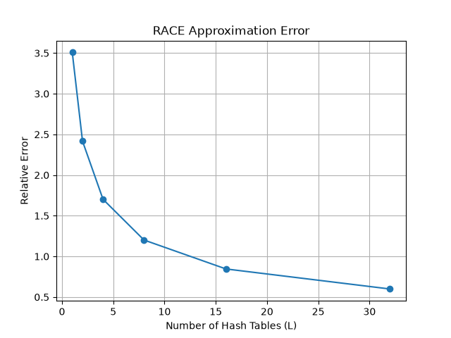
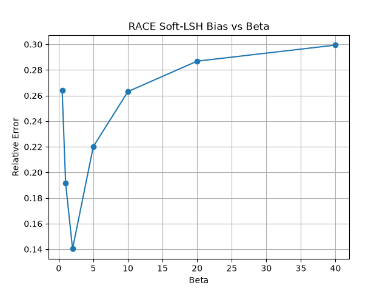
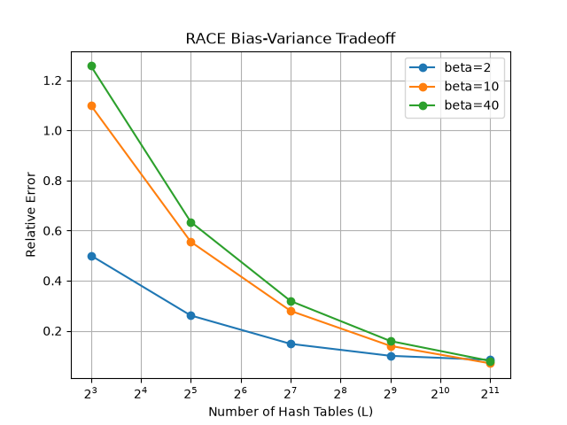
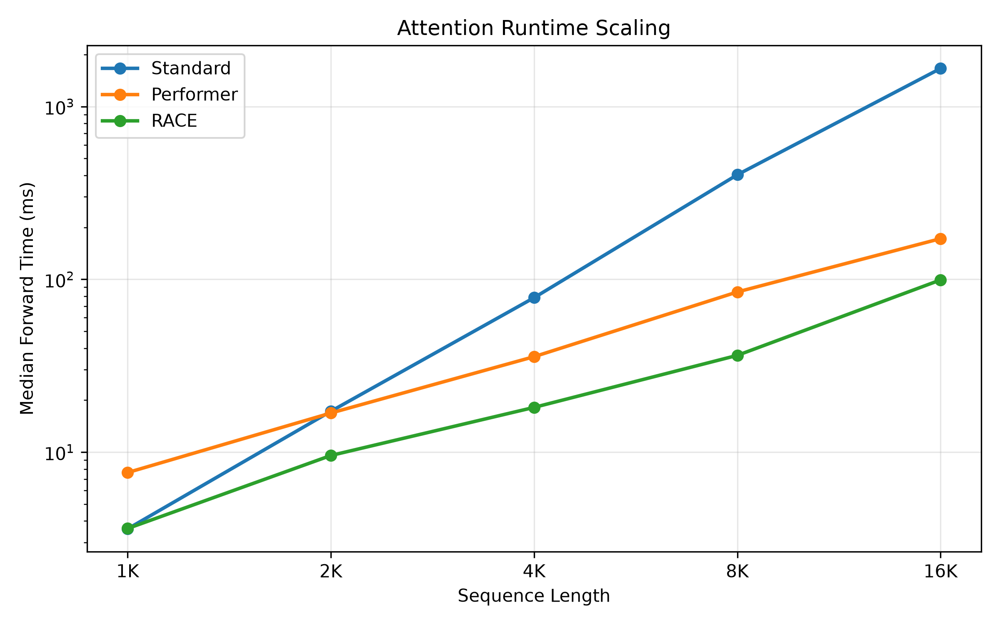
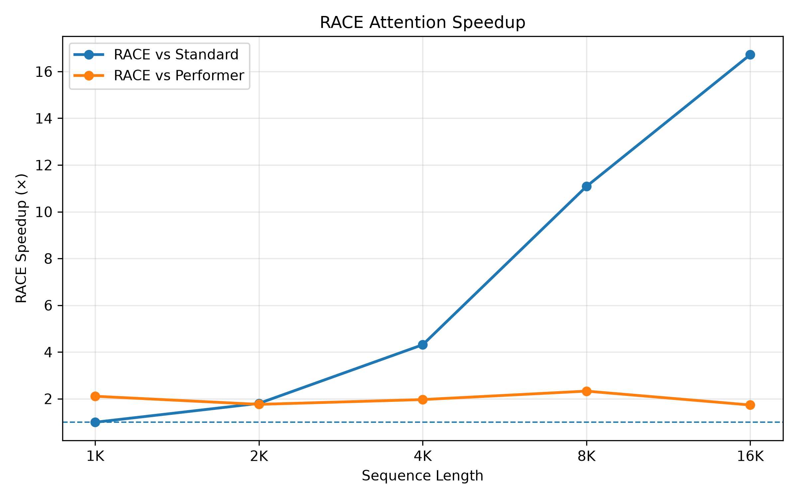
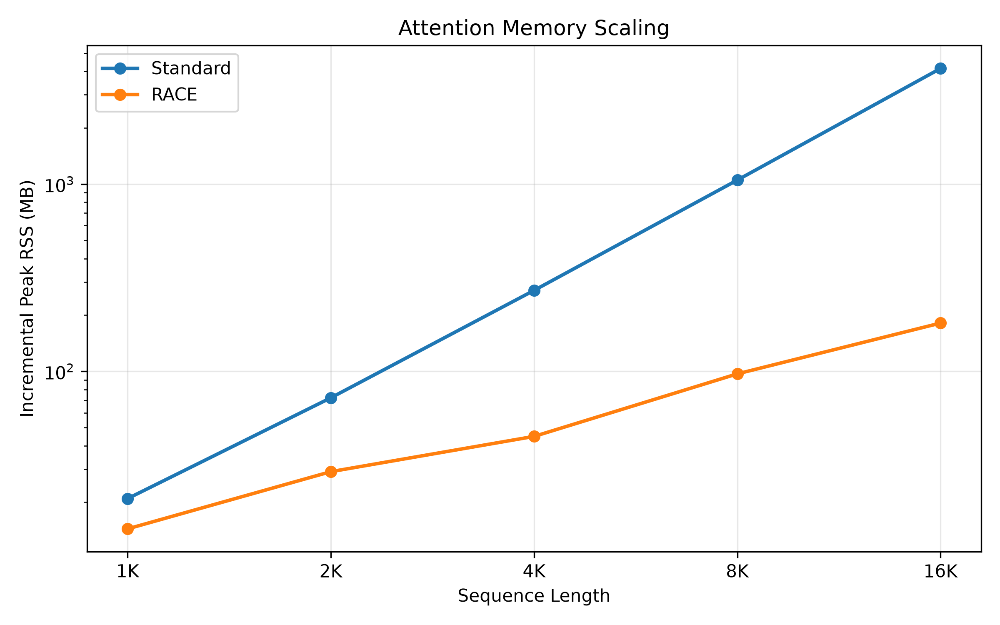
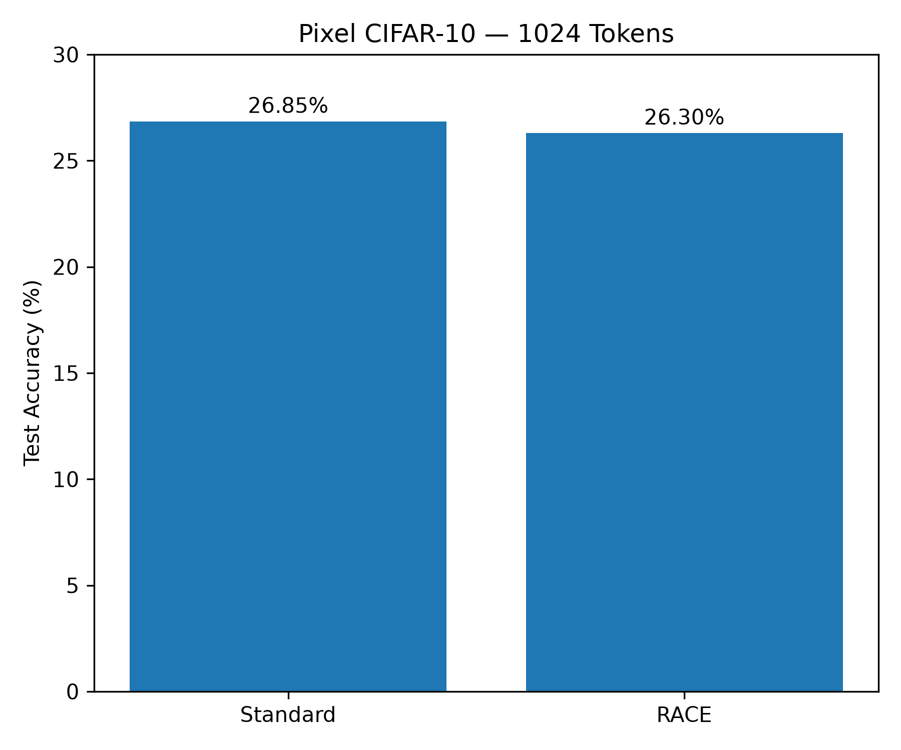
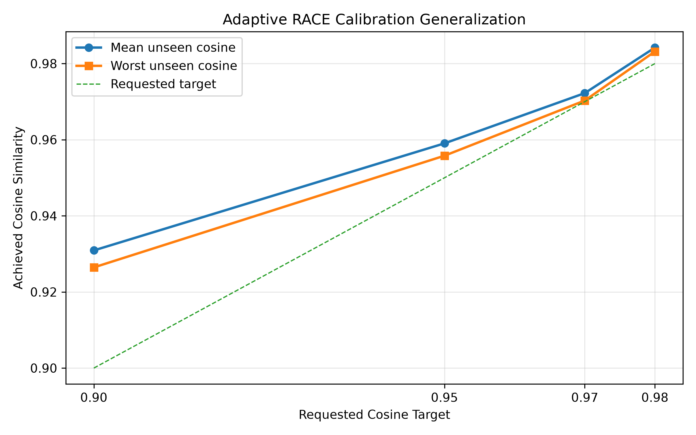
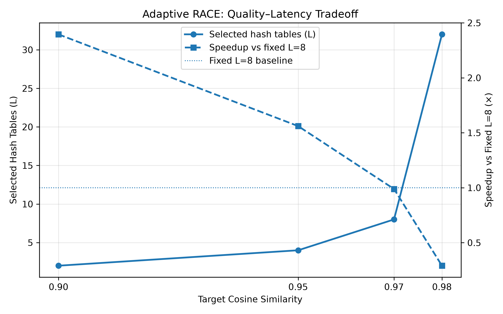

# RACE Attention: Reproduction, Benchmarking, and Adaptive Extension

An independent PyTorch reproduction and experimental study of **RACE Attention**, including approximation analysis, implementation optimization, runtime and memory benchmarking, downstream experiments, comparison with Performer, and a quality-budgeted Adaptive RACE extension.

> **Note:** This repository is an independent reproduction and experimental project. It is not the official RACE Attention implementation and is not affiliated with the original paper authors.

---

## Background

Transformer self-attention compares every token in a sequence with every other token.

Standard scaled dot-product attention is defined as:

```math
\mathrm{Attention}(Q,K,V) = \mathrm{softmax}\left(\frac{QK^\top}{\sqrt{d}}\right)V
```

For a sequence of length $`N`$, standard attention forms an $`N \times N`$ attention matrix.

As a result, the attention computation and memory requirements grow quadratically with sequence length. This becomes increasingly expensive as models process longer contexts.

**RACE Attention** takes a different approach.

Instead of explicitly computing every query-key interaction, RACE uses randomized projections, locality-sensitive hashing, and aggregation to approximate attention without constructing the full $`N \times N`$ attention matrix.

This allows its attention mechanism to scale approximately linearly with sequence length.

This project began as an attempt to independently reproduce and understand the RACE mechanism from the original paper. It later expanded into implementation optimization, approximation analysis, runtime and memory benchmarking, downstream testing, comparison with Performer, and an adaptive compute-quality extension.

---

## Original Paper

This project is based on:

**RACE Attention: A Strictly Linear-Time Attention for Long-Sequence Training**  
Sahil Joshi, Agniva Chowdhury, Amar Kanakamedala, Ekam Singh, Evan Tu, Anshumali Shrivastava  
**ICLR 2026**

- [OpenReview](https://openreview.net/forum?id=RR8Lh8RHgA)
- [ICLR Proceedings](https://proceedings.iclr.cc/paper_files/paper/2026/hash/25c33e5a972c885a50d777df18a7cdfc-Abstract-Conference.html)
- [arXiv](https://arxiv.org/abs/2510.04008)
- [Official RACE Repository](https://github.com/sahiljoshi515/RACE_Attention)

The original paper introduces **Repeated Arrays-of-Count Estimators (RACE) Attention**, a kernel-inspired alternative to Softmax attention designed for efficient long-sequence training.

---

## Project Goals

The main goals of this project were to:

1. reproduce the core RACE Attention mechanism in PyTorch,
2. understand how its approximation behaves,
3. study the effect of important parameters such as the number of hash tables and soft-hashing temperature,
4. optimize the implementation through vectorization and chunking,
5. measure runtime and memory scaling,
6. compare RACE with standard attention and Performer,
7. test RACE inside Transformer-style models,
8. study both successful and unsuccessful cases,
9. and explore whether the RACE compute budget can be selected based on a requested approximation-quality target.

The goal was not to exactly reproduce every benchmark from the original paper.

Instead, the project focuses on understanding the method from first principles and studying its behavior in a relatively simple PyTorch implementation on consumer hardware.

---

# How RACE Attention Works

## Sharpened Angular Similarity

RACE replaces the exponential similarity used by Softmax attention with a sharpened angular similarity.

For normalized query and key vectors:

```math
s(q,k) = \left(1 - \frac{\cos^{-1}(q^\top k)}{\pi}\right)^{\gamma}
```

where $`\gamma`$ controls how strongly the similarity concentrates around highly aligned vectors.

The important property is that this type of similarity can be estimated using randomized hashing.

---

## Random Projections and Soft Hashing

Queries and keys are projected using random hyperplanes.

Rather than using a completely discrete hash assignment, this implementation uses **soft assignments** to hash buckets.

For each hash table, the implementation:

1. projects the queries and keys,
2. computes soft bucket assignments,
3. aggregates key statistics inside the buckets,
4. aggregates value-weighted statistics,
5. and reconstructs an approximate attention output from those bucket summaries.

The full pairwise $`N \times N`$ attention matrix is never explicitly materialized.

---

## Repeated Hash Tables

A single randomized estimator can be noisy.

RACE therefore repeats the estimation process across $`L`$ independent hash tables.

This creates an important compute-quality tradeoff:

- smaller `L` → lower computational cost but higher approximation error,
- larger `L` → greater computational cost but lower estimator variance and generally better approximation quality.

A major part of this project was measuring this tradeoff experimentally.

---

# Implementation

The project was developed in several stages.

## 1. Basic RACE Implementation

File:

```text
race_attention.py
```

The first implementation was intentionally simple.

Its purpose was to make the algorithm easy to inspect and compare directly with exact attention.

It contains:

- random projections,
- hypercube corners,
- soft bucket assignments,
- RACE aggregation,
- and exact attention for controlled comparisons.

This version was primarily used to understand the mechanism before optimizing it.

---

## 2. PyTorch Attention Layer

File:

```text
race_layer.py
```

The next step was wrapping the RACE mechanism inside a PyTorch `nn.Module`.

The layer added:

- Q/K/V projections,
- multi-head attention,
- random projection matrices,
- output projection,
- configurable hash-table count `L`,
- projection count `P`,
- and soft-hashing temperature `beta`.

This allowed RACE to be inserted into Transformer-style architectures.

---

## 3. Vectorized Implementation

File:

```text
race_layer_vectorized.py
```

The initial implementation contained Python loops over the hash tables.

These calculations were later vectorized using PyTorch tensor operations and `einsum`.

Correctness was checked against the original implementation.

For the tested comparison, the maximum difference between the vectorized and reference implementations was:

```text
0.0
```

This showed that the vectorization preserved the behavior of the tested implementation while reducing Python-level overhead.

---

## 4. Chunked Implementation

File:

```text
race_layer_chunked.py
```

A chunked version was then created to balance:

- vectorization,
- temporary tensor size,
- runtime,
- and memory usage.

The later experiments primarily use:

```text
ChunkedRACEAttention
```

This became the main implementation used for the final runtime experiments.

---

# Approximation Analysis

## Effect of the Number of Hash Tables

One of the first experiments measured how approximation quality changed as the number of hash tables $`L`$ increased.

Example configuration:

- sequence length: `512`
- embedding dimension: `64`
- `P = 4`
- `beta = 5`
- trials: `5`

| L | Relative Error | Cosine Similarity |
|---:|---:|---:|
| 1 | 3.5082 | 0.2761 |
| 2 | 2.4169 | 0.3836 |
| 4 | 1.7021 | 0.5090 |
| 8 | 1.2013 | 0.6409 |
| 16 | 0.8455 | 0.7654 |
| 32 | 0.5992 | 0.8578 |

The measured approximation error decreased roughly like:

```math
O\left(\frac{1}{\sqrt{L}}\right)
```

over this experiment.



The experiment confirmed the expected general behavior: repeating the randomized estimator reduces variance and improves approximation quality.

---

# Soft-Hashing Temperature Study

The soft-hashing temperature `beta` also had a strong effect on approximation quality.

Using normalized queries and keys with:

```text
L = 128
```

the experiment produced:

| Beta | Relative Error | Cosine Similarity |
|---:|---:|---:|
| 0.5 | 0.2641 | 0.9645 |
| 1 | 0.1914 | 0.9817 |
| 2 | **0.1403** | **0.9901** |
| 5 | 0.2202 | 0.9765 |
| 10 | 0.2631 | 0.9670 |
| 20 | 0.2869 | 0.9612 |
| 40 | 0.2994 | 0.9579 |

For this configuration:

```text
beta ≈ 2
```

produced the best finite-$`L`$ approximation.



Because of this result, `beta=2` was used in most of the later experiments.

---

# Bias-Variance Behavior

The best `beta` value was not constant across every estimator budget.

Selected relative-error measurements were:

| L | beta=2 | beta=10 | beta=40 |
|---:|---:|---:|---:|
| 8 | 0.5005 | 1.0998 | 1.2571 |
| 32 | 0.2611 | 0.5553 | 0.6343 |
| 128 | 0.1477 | 0.2793 | 0.3187 |
| 512 | 0.1000 | 0.1395 | 0.1589 |
| 2048 | 0.0837 | **0.0699** | 0.0796 |

At smaller values of $`L`$, `beta=2` performed much better.

At very large $`L`$, larger values such as `beta=10` became competitive and eventually produced lower measured error in this experiment.

This illustrates a bias-variance tradeoff: the optimal soft-hashing behavior depends partly on the available estimator budget.



These experiments helped motivate treating $`L`$ as an explicit **compute-versus-quality control parameter**.

---

# Runtime Scaling

The final runtime benchmark compared:

- standard PyTorch multi-head attention,
- RACE Attention,
- Performer using `performer-pytorch`.

## Benchmark Configuration

- batch size: `1`
- embedding dimension: `128`
- attention heads: `4`
- CPU execution
- PyTorch CPU threads: `6`
- warm-up before measurement
- median runtime used for comparison

RACE configuration:

```text
L = 8
P = 4
beta = 2
chunk_size = 8
```

## Results

| Sequence Length | Standard | Performer | RACE | RACE vs Standard | RACE vs Performer |
|---:|---:|---:|---:|---:|---:|
| 1,024 | 3.60 ms | 7.63 ms | 3.62 ms | 0.99× | 2.11× |
| 2,048 | 17.26 ms | 16.85 ms | 9.58 ms | **1.80×** | **1.76×** |
| 4,096 | 78.35 ms | 35.71 ms | 18.17 ms | **4.31×** | **1.97×** |
| 8,192 | 402.83 ms | 84.55 ms | 36.34 ms | **11.09×** | **2.33×** |
| 16,384 | 1659.45 ms | 172.00 ms | 99.24 ms | **16.72×** | **1.73×** |

At 1,024 tokens, RACE and standard attention had almost identical runtime.

As sequence length increased, the quadratic cost of standard attention became increasingly visible.

At 16,384 tokens, the measured RACE implementation was:

- **16.72× faster than standard attention**
- **1.73× faster than the Performer implementation used in this benchmark**





## Performer Comparison Caveat

The Performer benchmark uses the public `performer-pytorch` `SelfAttention` implementation with the configuration used in this project.

These results should therefore be interpreted as an **implementation-level CPU comparison**.

They are not a claim that this RACE implementation universally outperforms every Performer implementation, optimized kernel, hardware platform, or configuration.

---

# Memory Scaling

Memory usage was measured separately using fresh processes and process-level RSS sampling.

The reported numbers represent **incremental peak RSS above the process baseline**.

They are not exact allocator-level tensor-memory measurements.

| Sequence Length | Standard Extra RSS | RACE Extra RSS | Reduction |
|---:|---:|---:|---:|
| 1,024 | 20.9 MB | 14.4 MB | 1.45× |
| 2,048 | 72.2 MB | 29.1 MB | 2.48× |
| 4,096 | 270.6 MB | 44.9 MB | 6.03× |
| 8,192 | 1050.7 MB | 96.9 MB | 10.84× |
| 16,384 | 4146.9 MB | 181.0 MB | **22.91×** |



At 16K tokens, the measured incremental process memory for standard attention was more than 4 GB, while the measured RACE increase was approximately 181 MB.

The memory experiment was kept separate from the runtime experiment because absolute memory measurements can depend heavily on allocator behavior, process state, and machine conditions.

The most important observation is the difference in **scaling behavior**.

---

# Downstream Experiments

Runtime benchmarks alone do not show whether an approximate attention mechanism remains useful inside an actual model.

Several downstream experiments were therefore performed.

---

## Short-Sequence CIFAR-10 ViT

The first experiment used small Vision Transformers on CIFAR-10.

Both models had:

- 412,810 parameters
- patch size: `4`
- approximately 65 tokens
- embedding dimension: `128`
- 2 Transformer blocks
- 4 attention heads

After 3 epochs:

| Model | Test Accuracy | Training Time |
|---|---:|---:|
| Standard ViT | **59.42%** | 924.41 s |
| RACE ViT | 53.90% | 1005.88 s |

This was an important negative result.

At only approximately 65 tokens, standard attention is already inexpensive.

The additional hashing and aggregation overhead of RACE therefore provided no runtime advantage and made the model both slower and less accurate in this experiment.

This result motivated testing RACE on genuinely longer sequences.

---

# Pixel CIFAR-10: 1024 Tokens

To create a longer sequence classification task, CIFAR-10 images were converted to grayscale and flattened into individual pixel tokens.

A $`32 \times 32`$ image therefore becomes:

```math
32 \times 32 = 1024
```

tokens.

## Model Configuration

- sequence length: `1024`
- embedding dimension: `64`
- Transformer blocks: `2`
- attention heads: `4`
- parameters: `182,666`
- training examples: `10,000`
- test examples: `2,000`
- epochs: `10`
- random seed: `42`

## Results

| Model | Final Test Accuracy | Total Training Time |
|---|---:|---:|
| Standard | **26.85%** | 1584.46 s |
| RACE | 26.30% | 2454.65 s |



RACE finished only:

```text
0.55 percentage points
```

below standard attention in final test accuracy.

However, it remained slower in total end-to-end CPU training time at this sequence length.

This distinction is important.

The isolated attention kernel begins showing a substantial advantage as sequence length grows, but full-model training includes many other operations:

- projections,
- feed-forward networks,
- normalization,
- backward passes,
- optimization,
- and implementation overhead.

Therefore:

> faster attention does not automatically mean faster end-to-end model training.

This Pixel CIFAR experiment is **inspired by long-sequence image classification**, but it is not claimed to be an exact reproduction of the official Long Range Arena benchmark.

---

# Associative Recall

A synthetic associative-recall task was also created to test long-context information retrieval.

A target key/value pair appears near the beginning of a sequence.

The rest of the sequence contains distractors.

At the end of the sequence, the model receives a query key and must recover its associated value.

## Configuration

- keys: `32`
- values: `32`
- vocabulary size: `65`
- chance accuracy: `3.125%`
- training examples: `6000`
- test examples: `1000`
- embedding dimension: `128`
- attention heads: `4`
- Transformer layers: `2`
- training epochs: `10`

---

## 512 Tokens (3 Seeds)

| Model | Mean Accuracy | Std. Dev. |
|---|---:|---:|
| Standard | 62.37% | 3.27 |
| RACE | **64.80%** | 1.66 |

---

## 1024 Tokens (2 Seeds)

| Model | Mean Accuracy |
|---|---:|
| Standard | 54.1% |
| RACE | **64.7%** |

These experiments suggest that the RACE model can remain competitive on a task requiring information retrieval across long contexts.

However, the number of seeds is limited.

The results should therefore be treated as exploratory rather than evidence that RACE is generally more accurate than standard attention.

---

# Quality-Budgeted Adaptive RACE

After reproducing and benchmarking fixed-budget RACE, the project explored an additional engineering idea.

A normal RACE configuration uses a fixed hash-table count such as:

```text
L = 8
```

for every input.

However, $`L`$ directly controls both approximation quality and computational cost.

This raises a simple question:

> Can the system choose the smallest value of $`L`$ that satisfies a requested approximation-quality target?

This creates a configurable **quality-versus-latency policy**.

Instead of always paying for a fixed estimator budget, applications that tolerate slightly lower approximation quality may be able to use fewer hash tables.

---

# Initial Adaptive Sweep

The first adaptive experiment evaluated:

```text
L = 1, 2, 4, 8, 16, 32
```

against exact attention.

Across sequence lengths from 1,024 to 4,096 tokens, the expected pattern appeared:

```text
smaller L → faster execution / lower cosine similarity
larger L  → slower execution / higher cosine similarity
```

Example target selections were:

| Requested Cosine | Selected L |
|---:|---:|
| 0.90 | 2 |
| 0.95 | 4 |
| 0.97 | 8 |
| 0.98 | 16 |

However, evaluating exact attention every time a decision is made would eliminate much of the purpose of using efficient attention.

The method was therefore changed to use **offline calibration**.

---

# Conservative Offline Calibration

The final adaptive experiment used a calibration set to choose $`L`$ before evaluating unseen inputs.

## Configuration

- sequence length: `2048`
- candidate values:

```text
L = 1, 2, 4, 8, 16, 32
```

- calibration samples: `10`
- unseen test samples: `20`
- baseline: fixed `L = 8`

The policy selects:

> the smallest $`L`$ whose **worst calibration cosine similarity** satisfies the requested quality target.

Using the worst calibration result rather than the mean makes the policy more conservative.

---

## Calibration Results

| L | Mean Calibration Cosine | Worst Calibration Cosine |
|---:|---:|---:|
| 1 | 0.8839 | 0.8796 |
| 2 | 0.9306 | 0.9284 |
| 4 | 0.9588 | 0.9574 |
| 8 | 0.9722 | 0.9714 |
| 16 | 0.9799 | 0.9789 |
| 32 | 0.9841 | 0.9834 |

This produced the following policies:

```text
target 0.90 → L = 2
target 0.95 → L = 4
target 0.97 → L = 8
target 0.98 → L = 32
```

---

# Adaptive Generalization to Unseen Inputs

The selected policies were then evaluated on 20 unseen synthetic inputs.

| Target | Selected L | Mean Unseen Cosine | Worst Unseen Cosine | Speed vs Fixed L=8 |
|---:|---:|---:|---:|---:|
| 0.90 | 2 | 0.9309 | **0.9265** | **2.40× faster** |
| 0.95 | 4 | 0.9590 | **0.9558** | **1.56× faster** |
| 0.97 | 8 | 0.9722 | **0.9703** | ~1.0× |
| 0.98 | 32 | 0.9842 | **0.9832** | 0.29× |

All four policies met their requested cosine-quality floor on the 20 unseen synthetic test inputs.





The experiment demonstrates the expected quality-latency tradeoff.

For relaxed approximation targets:

```text
0.90 → 2.40× faster than fixed L=8
0.95 → 1.56× faster than fixed L=8
```

For stricter targets, more hash tables were required.

At the `0.98` target, the policy selected:

```text
L = 32
```

which was significantly slower than the fixed `L=8` baseline.

The adaptive approach therefore does not guarantee a speedup.

Instead, it provides a mechanism for explicitly controlling the relationship between approximation quality and computational cost.

> **Important:** Adaptive RACE is an experimental project extension. This repository does not claim that it is a new attention algorithm or a proven novel research contribution.

The current calibration experiments use synthetic random inputs and a controlled sequence length.

Much broader testing would be required before drawing stronger conclusions.

---

# What Worked

Several behaviors were reproduced successfully.

- approximation quality generally improved as the number of hash tables increased,
- vectorization preserved the tested implementation behavior,
- RACE runtime scaling became increasingly favorable as sequence length increased,
- measured process memory grew much more slowly than standard attention,
- RACE outperformed the Performer implementation used here from 2K through 16K tokens,
- long-context associative recall remained competitive,
- and offline calibration successfully selected lower-cost RACE configurations for relaxed approximation targets.

---

# What Did Not Automatically Work

The project also produced several useful negative results.

- RACE was not faster than standard attention at very short sequence lengths.
- The short-sequence CIFAR-10 ViT was slower and less accurate with RACE.
- Pixel CIFAR training at 1024 tokens remained slower end-to-end on CPU.
- Increasing `L` simply because the sequence length increased made some long-context configurations unnecessarily expensive.
- Selecting adaptive configurations using only mean calibration quality was not conservative enough for the strictest targets.
- Very high approximation-quality targets can require enough hash tables to eliminate the runtime advantage.

These failures helped determine which later experiments were worth running.

---

# Main Takeaways

The main lessons from this project were:

- efficient attention is not automatically faster at short sequence lengths,
- implementation overhead matters,
- RACE becomes increasingly attractive as sequence length grows,
- the number of hash tables $`L`$ provides a direct accuracy-compute tradeoff,
- soft-hashing parameters create a meaningful bias-variance tradeoff,
- memory scaling can matter as much as raw runtime,
- isolated attention-kernel speed does not necessarily translate directly to end-to-end training speed,
- negative results are valuable because they show where an approximation method is actually useful,
- and offline calibration can turn a fixed RACE configuration into a configurable quality-budget policy.

Overall, this project evolved from a paper reproduction into a broader study of how approximation quality, computational cost, runtime, memory, and downstream model behavior interact in an efficient-attention mechanism.

---

# Repository Structure

## Core Implementations

```text
race_attention.py
race_layer.py
race_layer_vectorized.py
race_layer_chunked.py
```

## Approximation and Parameter Analysis

```text
accuracy_benchmark.py
beta_benchmark.py
bias_variance.py
tradeoff.py
```

## Runtime and Memory Scaling

```text
benchmark.py
rigorous_benchmark.py
accurate_memory.py
memory_profile.py
scaling_transformer.py
scaling_all.py
benchmark_performer.py
```

## Downstream Experiments

```text
train_standard_vit.py
train_race_vit.py
benchmark_race_vit.py
pixel_cifar.py
associative_recall.py
```

## Adaptive RACE

```text
adaptive_race.py
adaptive_quality.py
adaptive_thresholds.py
adaptive_calibration.py
adaptive_calibration_conservative.py
```

## Final Results and Figures

```text
final_results.py
plot_adaptive_results.py
plot_adaptive_results_final.py
figures/
```

---

# How to Run

## 1. Clone the Repository

```bash
git clone https://github.com/zaljerme/race-attention.git
cd race-attention
```

## 2. Create a Virtual Environment

Windows PowerShell:

```powershell
python -m venv venv
.\venv\Scripts\Activate.ps1
```

## 3. Install Dependencies

```powershell
pip install -r requirements.txt
pip install performer-pytorch
```

## 4. Run the Main Benchmarks

### Standard vs RACE vs Performer

```powershell
python benchmark_performer.py
```

### Approximation Analysis

```powershell
python accuracy_benchmark.py
python beta_benchmark.py
python bias_variance.py
```

### Memory Benchmark

```powershell
python accurate_memory.py
```

### Adaptive RACE Experiment

```powershell
python adaptive_calibration_conservative.py
```

### Generate Final Figures

```powershell
python final_results.py
python plot_adaptive_results_final.py
```

### Optional Downstream Experiments

These take longer on CPU:

```powershell
python pixel_cifar.py
python associative_recall.py
```

---

# Experimental Environment

The final experiments were performed primarily on a CPU-only PyTorch setup.

Experiments were run across two different CPU-based Windows machines during development. Neither system had a supported NVIDIA/CUDA GPU available for the final benchmarks, so the reported results focus on CPU runtime, memory scaling, and implementation behavior rather than optimized GPU performance.

Representative hardware:

- Intel Core i7-8700K
- 32 GB RAM
- AMD Radeon RX 5600
- Windows
- PyTorch CPU execution
- 6 PyTorch CPU threads for the final scaling benchmark
- CUDA unavailable

The AMD GPU was not used for the reported PyTorch benchmarks.

Absolute runtime numbers should not be expected to transfer directly to different:

- CPUs,
- GPUs,
- libraries,
- compilers,
- operating systems,
- or optimized custom kernels.

The more meaningful result is the **relative scaling behavior measured within the same environment**.

---

# Limitations

This repository should be treated as an independent reproduction and engineering study rather than a replacement for the official RACE paper or implementation.

Important limitations include:

### CPU-Focused Implementation

The project does not reproduce the optimized CUDA or CPU kernels used by the original RACE implementation.

### Experimental Scale

The original paper evaluates larger workloads and more optimized hardware. This project focuses on sequence lengths practical on a personal CPU-based system.

### Performer Baseline

The Performer comparison uses the public `performer-pytorch` implementation rather than a fully tuned reproduction of all Performer configurations from the literature.

### Memory Measurement

Memory results use sampled process-level RSS.

They should not be interpreted as exact allocator-level tensor-memory measurements.

### Pixel CIFAR

The 1024-token Pixel CIFAR experiment is inspired by long-sequence image classification but is not an exact official Long Range Arena reproduction.

### Limited Seeds

Several downstream experiments use a relatively small number of random seeds because CPU training is expensive.

### Adaptive Calibration

Adaptive RACE is currently validated using synthetic inputs at one controlled sequence length.

It has not yet been extensively tested across:

- large trained language models,
- many Transformer layers,
- diverse datasets,
- changing sequence lengths,
- or different hardware platforms.

### No Novelty Claim

The Adaptive RACE experiments are presented as an engineering extension and exploration.

This repository does not claim that the idea is novel without a broader literature review and substantially more validation.

---

# Citation

If you use the original RACE Attention method, please cite the original authors:

```bibtex
@inproceedings{joshi2026raceattention,
  title     = {RACE Attention: A Strictly Linear-Time Attention for Long-Sequence Training},
  author    = {Joshi, Sahil and Chowdhury, Agniva and Kanakamedala, Amar and Singh, Ekam and Tu, Evan and Shrivastava, Anshumali},
  booktitle = {International Conference on Learning Representations},
  year      = {2026},
  url       = {https://openreview.net/forum?id=RR8Lh8RHgA}
}
```

---

# Acknowledgements

RACE Attention was introduced by **Sahil Joshi, Agniva Chowdhury, Amar Kanakamedala, Ekam Singh, Evan Tu, and Anshumali Shrivastava**.

The original paper and official repository should be treated as the authoritative sources for the RACE method.

This repository was built independently for reproduction, experimentation, benchmarking, optimization, and learning.
